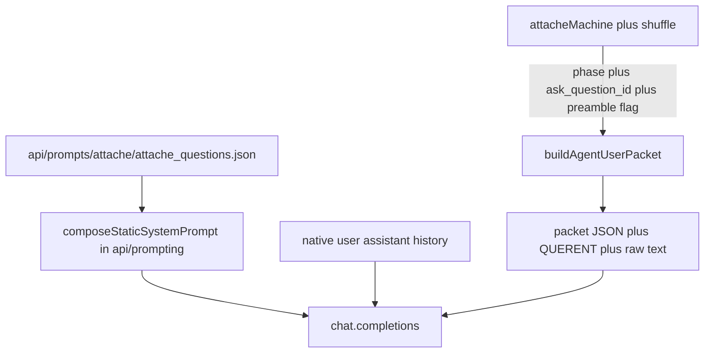

# Frozen system, pointers, native history

Keep XState as the orchestrator. Stop rewriting the system string. Address the review issues explicitly (history roles, no identical retry, no catalog dump in the user channel, phased delete, packet schema).

## Why this design (the real problem)

The product is not “a chatbot with a long prompt.” It is an **Agency**: ritual at the desk, therapy in the inner office, chorus offstage. Prompt complexity exploded because four different kinds of knowledge were concatenated into one mutating system string.

| Kind | What it is in the fiction | Where it belongs |
|------|---------------------------|------------------|
| **Ethos** | Who is speaking (attaché, detective, Lumen, Umbra) | Frozen `api/prompts/*_persona.md` + instructions. Same bytes every turn. |
| **Nomos** | The building’s law (which room, which form, which Baseline item) | XState + a tiny packet of flags/pointers. Not prose. |
| **Mneme** | Continuity of *this* querent (dossier, summary, last N turns) | Dossier + summary field + **native chat history**. |
| **Kairos** | This utterance | After `---QUERENT---`. Untouched. |

Today catalogs and `# TURN INSTRUCTIONS` mix all four. The model cannot tell the Agency’s identity from this morning’s sticky note, so it improvises the form *or* ignores the person.

**Attaché = finite game with a mercy clause** (finish the Baseline, unless the querent is clearly done). Verbatim questions are liturgy. The full bank lives in the frozen system (the clerk has the whole exam); the packet only says which item is now; the **server** stamps the form if the clerk *forgets* a line. If the clerk *chooses* to drop the form because the querent is upset, tired, finished, or frustrated, that is a named protocol (`suspend_script`), not a prompt footnote — and the stamp must not overwrite it. The crack in the bureaucracy is **rare and judged**, not a random roll.

**Detective = infinite game inside a finite frame** (locked): frozen persona **plus** a short handbook per stage (`initial` / `middle` / `final`, return, close). The packet points at the stage; it does not paste a new script every turn. The conversation (native history) carries the work; the handbook only sets *stance*, not lines to recite.

**Lumen / Umbra = chorus.** Frozen voice; packet is narrative phase + dossier subtext + `secrets_revealed`. They are not intake clerks.

Do not manage prompt complexity by writing more prompt. Move law into machines, keep character still, let dialogue be dialogue.

Frozen character is not a dead character: a stable ethos is how therapy and infinite play stay open. Fun is **constraint plus permission** — dry procedure at the desk, poetry once the file is open — not extra coaching pasted every turn.

## Four stores (software, not more prompt)

Prompt complexity is state living in the wrong layer. Do not prompt-engineer a state machine; XState already is one.

- **XState** — the building: phase, question index, shuffle, visit clocks, two-turn therapy confirm, explore/close. Emits **facts**, never markdown.
- **Frozen system** — character and the books on the desk: persona, stage/room handbooks, Attaché question bank. Byte-identical every turn (invariance tests).
- **Native history** — the relationship. Models are trained on `user`/`assistant` roles; flattening dialogue into JSON makes a therapist forget they are in a conversation. `recent_turns` does **not** belong in the packet.
- **Tiny packet** — this turn’s sticky note: pointers and flags only (`phase`, `ask_question_id`, `existential_therapy_phase`, `greeting_mode`, …).

**Authoring rule** (use when writing or moving copy):

- True in **every** turn for that speaker → frozen instructions / persona.
- True only in **this room or stage** (explore vs Baseline vs close; therapy initial/middle/final) → frozen handbook keyed by a packet flag.
- True only **this visit** (which question, preamble pending, opening line id) → packet pointer/flag.
- About **this person** → dossier, `summary`, native history.
- Experience **breaks if the model paraphrases it** → **code** (server inject, machine gates). Mercy is the exception that **disables** that stamp.

Literary work still lives in [`api/prompts/`](api/prompts/). The envelope exists so writing voice does not also mean rewriting the building.

## Layout (current repo)

Canonical map: [AGENTS.md](AGENTS.md) and [.cursor/rules/project-layout.mdc](.cursor/rules/project-layout.mdc). Do **not** add files under `frontend/` (leftovers there are not the live tree). Anything `require()`d in production stays inside `api/` (SWA `api_location`).

| Concern | Path |
|--------|------|
| Model text (persona, catalogs, question bank, handbooks) | [`api/prompts/`](api/prompts/) |
| Composer / registry / packet builders | [`api/prompting/`](api/prompting/) |
| Attaché / detective / philosophers runtime + XState | [`api/agents/attache/`](api/agents/attache/), [`api/agents/detective/`](api/agents/detective/), [`api/agents/philosophers/`](api/agents/philosophers/) |
| Shared LLM plumbing (messages, preview, refusal) | [`api/agents/shared/`](api/agents/shared/) — not a character |
| Turn routing | [`api/orchestration/`](api/orchestration/), [`api/chatService.js`](api/chatService.js) |
| Dossier + summarizer | [`api/dossier/`](api/dossier/) |
| Scenario lab (API) | [`api/lab/`](api/lab/) |
| Scenario lab (HTML) | [`web/lab/`](web/lab/) |
| HTTP contract | [`api/contracts/`](api/contracts/) |
| Local Express | [`server-dev.js`](server-dev.js) |

Keep **prompts vs prompting** split: question bank markdown/JSON is `api/prompts/`; `composeStaticSystemPrompt` / packet registry is `api/prompting/`.

## Attaché questions in the system prompt (locked)

**Verdict:** putting the **full question bank** in the frozen attaché system is a good idea. Passing **phase alone is not enough**.

Today [`api/agents/attache/attacheRuntime.js`](api/agents/attache/attacheRuntime.js) shuffles per session (`baseline_question_order`) and [`api/agents/attache/attachePromptContext.js`](api/agents/attache/attachePromptContext.js) maps `question_index` → a pool slot. Phase does not identify the line. The bank is large (~20 / ~27 / ~20+ items in [`api/prompts/attache/attache_questions.json`](api/prompts/attache/attache_questions.json)) and baseline 1 even repeats some strings, so IDs must be **index-stable** (`B1-Q00` …), not content hashes.

**Locked shape:**

- Frozen attaché system (identical for every session) includes persona, protocol handbook (start / explore / baseline / close), the three baseline preambles from [`api/prompts/attache/attache_phase_transition_instructions.json`](api/prompts/attache/attache_phase_transition_instructions.json), and the **entire numbered bank**.
- Server still owns shuffle. Packet gets only the **current** pointer: `ask_question_id` (e.g. `B2-Q07`), not the rest of `baseline_question_order` (future questions in the packet invite leaking).
- Also pass `phase` and `deliver_baseline_preamble` (boolean, computed from `question_index === 0` / delivery-start — do **not** make the model infer “already shown” from history).
- Instructions: look up `ask_question_id` in the system bank and pose that text verbatim; never invent; never ask a different bank item.
- **Do not** also put the question text in `turn_task` or a `question_at_hand` string. Pointer in packet, copy in system.

Opening lines use the same pattern: bank in frozen system (from [`api/agents/attache/attacheOpeningLines.js`](api/agents/attache/attacheOpeningLines.js) / prompts files), `opening_line_id` in the packet when needed.

**Server owns verbatim protocol, with mercy** (replaces identical LLM retry): in [`attacheRuntime.js`](api/agents/attache/attacheRuntime.js) / [`attacheCall.js`](api/agents/attache/attacheCall.js):

- If `ask_question_id` is set, `suspend_script` is **false**, and the model did not pose the bank text (`asked_baseline_question: false` **or** `user_response` missing the line) → **inject** the question and set `asked_baseline_question` true. Optional: one retry with a **one-line user suffix** (“pose ask_question_id now”), never the same payload at temperature 0.2.
- If `suspend_script` is **true** → **do not inject**, **do not advance** `question_index`. Reply stays in character. Then apply room change: `user_intends_close` → close (existing early-exit); `user_intends_explore` → explore (pause, same question waiting); neither → **stay on the same Baseline item** (a care beat). Next turn the packet still has the same `ask_question_id` unless they left the room.

Bookmark: exact wording is enforced in code when the script is on; when mercy fires, the human line wins.

## Attaché script mercy (locked)

The Baseline is liturgy, not a trap. Frozen handbook (not a catalog dump): default is still to pose `ask_question_id`. **Exception, used sparingly:** if the querent is clearly upset, exhausted, finished, or frustrated — including affect without the words “stop” or “see the detective” — the attaché may drop the question this turn, reply in character (still bureaucratic, not a second therapist), and set `suspend_script: true`. Mild reluctance, jokes, or “this is weird” are **not** enough; when uncertain, keep the script.

**“Small chance” is not `Math.random()`.** A server coin-flip would sometimes stamp a question onto a distressed reply, or break ritual for no reason. The rarity lives in the frozen instructions (high bar, prefer false). The model judges; the flag tells the stamp to stand down.

Wire into existing rooms rather than a fourth machine:

- Stay on item: care beat, same `ask_question_id` next turn ([`attacheMachine.transition`](api/agents/attache/attacheMachine.js) already holds index when `asked_baseline_question` is false).
- Explore: they need a minute / have questions — existing `user_intends_explore`.
- Close: they are done or want out — existing `user_intends_close` (early-exit confirm still applies).

Add `suspend_script` (boolean, required, default false) to the attaché Structured Outputs schema ([`api/prompts/attache/attache_turn.schema.json`](api/prompts/attache/attache_turn.schema.json); copy from leftover `frontend/` into `api/` if missing). Normalize it in [`attacheCall.js`](api/agents/attache/attacheCall.js). `asked_baseline_question` must be false when `suspend_script` is true (if both true, honor mercy and ignore the ask flag). Do not send `suspend_script` in the **packet**; it is an **output** the model sets from the querent’s line.

Tests: fixture where `ask_question_id` is set, model returns `suspend_script: true` and no bank text → response is not appended, `question_index` unchanged; fixture where `suspend_script: false` and question omitted → inject. Mock attaché output must include the new field.

## Target `messages[]` (history decision reopened)

1. `system` — frozen per **agent** (persona + instructions + attaché bank/handbook from `api/prompts/`). No catalog bodies, no session copy, no schema dump. Short “API enforces JSON” reminder only.
2. Prior turns as **native** `user` / `assistant` roles (last `HISTORY_TAIL_TURNS`, default 8). Not inside the JSON packet. Current utterance is **not** in this list (call sites already snapshot history before `push`).
3. One this-turn `user` message: `JSON.stringify(canonicalPacket)` + `\n\n---QUERENT---\n` + raw querent text.

Packet is flags and pointers only. Prefer a single `summary` string in the packet, not a duplicated history dump.

Parse contract in every `api/prompts/**/*_instructions.md`: parse **one** JSON object from the start of the user message; then read after `---QUERENT---`. Compact JSON with **explicit key order** from a registry in `api/prompting/` (not `JSON.stringify` insertion order). Omit empty optionals consistently (omit, never `null`/`""` mix).

Keep a **lab overlay** (instruction ids, machine snapshot, timestamps) that is never passed to the formatter. The packet is model-facing; lab panes in [`api/lab/chatScenarioPreview.js`](api/lab/chatScenarioPreview.js) + [`web/lab/chat-scenario.html`](web/lab/chat-scenario.html): frozen system / packet JSON / native history / QUERENT.

## Minimal packets (no telemetry)

**Attaché:** `packet_version`, `phase`, `ask_question_id` (optional), `deliver_baseline_preamble` (optional), `opening_line_id` (optional), `greeting_mode` (single derived enum — see below), `baseline_paused` (explore after interrupting baseline). No `turn_task` markdown if the handbook covers start/explore/close.

**Detective (locked: handbook-stages, not free-improv-only):** `packet_version`, `existential_therapy_phase`, `greeting_mode`, `closure_phase`, `opening_line_id` (first-scene only), `dossier_summary`, `summary`. Frozen persona **plus** a short handbook per stage under `api/prompts/detective/` (initial / middle / final, return, close) keyed by those flags. Stance and constraints, not verbatim lines. Catalogs shrink; do not dump remaining rows into `turn_task` as a permanent home.

**Lumen / Umbra:** `packet_version`, `narrative_phase`, `dossier_summary`, `secrets_revealed` (keep — it is in `SAFE_VIEW_KEYS` in [`api/prompting/promptComposer.js`](api/prompting/promptComposer.js) today and must not silently drop), `summary`.

**Helpers (not fake chat agents):** summarizer packet `{ conversation }`; dossier `{ transcript, existing_traits }`. Shared `formatUserChannelMessage` in `api/prompting/` (or `api/agents/shared/` if it is pure message formatting). Do not run them through `buildAgentUserPacket(agentKey)`. New helper system files live under `api/prompts/summarizer/` and `api/prompts/dossier/` — not inside `api/dossier/*.js`.

## Single greeting enum (visit vs dossier)

Do not send both `visit_bin` and `dossier_status`. Derive one `greeting_mode` in the packet mapper from existing clocks (`visit_bin` + dossier age/presence in [`api/orchestration/chatMachine.js`](api/orchestration/chatMachine.js) / [`api/dossier/dossier.js`](api/dossier/dossier.js)): e.g. `none | day_or_so | long_gone | stale_rebaseline | stale_dossier | no_dossier`. Handbook sections keyed by that enum.

## XState role

Machines stay under `api/agents/{attache,detective,philosophers}/` and [`api/orchestration/chatMachine.js`](api/orchestration/chatMachine.js). They emit **domain facts** only (`phase`, `question_index`, `visit_bin`, `closure_phase`, `asked_baseline_question`, shuffle order on the session). [`computeAttacheCatalogInstructionIds`](api/agents/attache/attachePromptPolicy.js) / [`computeDetectiveCatalogInstructionIds`](api/agents/detective/detectivePromptPolicy.js) keep selecting ids **only while catalogs still exist**; the packet mapper in `api/prompting/` turns facts → pointers/flags. Question text is **not** a machine output.

## Compose hub

Replace the growing system string in [`api/prompting/promptComposer.js`](api/prompting/promptComposer.js):

- `composeStaticSystemPrompt(agentKey)` — [`api/prompting/promptRegistry.js`](api/prompting/promptRegistry.js) files only; attaché concatenates a generated bank markdown from `attache_questions.json` (deterministic ID assignment). Forbidden: session, catalog fill, schema dumps.
- `buildAgentUserPacket(agentKey, facts)` — allowlisted fields from a **field registry** (e.g. `api/prompting/packetRegistry.js`: JSDoc + schema + key order).
- `formatUserChannelMessage(packet, querentText)`.
- [`api/agents/shared/buildChatCompletionMessages.js`](api/agents/shared/buildChatCompletionMessages.js): `[system, ...nativeHistory, userChannel]`. History items are `{role, content}` with user-facing assistant text (already how [`attacheRuntime.js`](api/agents/attache/attacheRuntime.js) / [`chatService.js`](api/chatService.js) store replies). Cap per-turn content length.

Call factories ([`attacheCall.js`](api/agents/attache/attacheCall.js), [`detectiveCall.js`](api/agents/detective/detectiveCall.js), [`philosophersCall.js`](api/agents/philosophers/philosophersCall.js)) take `{ systemContent, chatHistory, userChannelContent, response_format }`.

**Tests** (listed in [`api/package.json`](api/package.json)): invariance — `composeStaticSystemPrompt` is `===` across start/explore/baseline/close, visit bins, therapy stages (do **not** SHA-lock file bytes; Windows CRLF will flake). Packet fixtures: canonical JSON for a given facts object. Envelope regex: user channel starts with `{` and contains `\n\n---QUERENT---\n`. Assert current utterance is absent from `chatHistory` passed into the builder. Put new tests next to the code (`api/prompting/*.test.js`, `api/agents/attache/*.test.js`).

## Prompt files and catalogs

- [`api/prompts/attache/attache_instructions.md`](api/prompts/attache/attache_instructions.md): packet field list, `ask_question_id` lookup rule, QUERENT parse rule, intent-flag defaults, **`suspend_script` mercy (high bar, prefer false, still in character, not a second detective)**. Remove “follow `# TURN INSTRUCTIONS`”.
- Generate or check in `api/prompts/attache/attache_question_bank.md` (or build at compose time from JSON) with stable IDs. Duplicate pool strings keep distinct IDs.
- Attaché room handbook in frozen system: start / explore / baseline / close, plus the mercy paragraph (ritual default, exceptional break).
- Detective stage handbooks under `api/prompts/detective/` (reuse existential_therapy `initial` / `middle` / `final` if present): stance and constraints keyed by `existential_therapy_phase`; return/close similarly. Do not quote internal field names to the querent.
- Lumen / umbra: frozen voice + how to use `dossier_summary` / `narrative_phase` / `secrets_revealed` as subtext.
- Catalogs (`api/prompts/*/prompt_catalog.json`): **expire**. Move evergreen rules into frozen handbooks. Do not keep a `turn_task` compatibility dump as the long-term design. Delete empty rows (`ATTACHE_RETURN_APPEND_FRESH_DOSSIER`) as they lose their last reader.
- Delete [`api/agents/philosophers/philosophersCustomPrompt.js`](api/agents/philosophers/philosophersCustomPrompt.js) on the philosopher slice, not before lab/tests are retargeted.

[`docs/agent-prompt-construction.md`](docs/agent-prompt-construction.md) must include the ethos/nomos/mneme/kairos map and the authoring rule, not only the message envelope.

## Helpers

[`api/dossier/summarization.js`](api/dossier/summarization.js): frozen summarizer system (`api/prompts/summarizer/`) + packet `{ conversation }` + Structured Outputs `{ summary }`. Stop returning `# MEMORY SUMMARY` + `# RECENT HISTORY` as one string. Session stores `summary` + full `chat_history`; the model sees `summary` in the packet and last N native turns.

[`api/dossier/dossier.js`](api/dossier/dossier.js): move JS prompt constants to `api/prompts/dossier/`. Keep `response_format: json_object` (open-ended trait lists cannot use strict `json_schema` without a closed enum). Same delimiter helper, different builder.

## Lab, logs, docs

Retarget [`api/agents/shared/llmPayloadPreview.js`](api/agents/shared/llmPayloadPreview.js) / [`api/lab/chatScenarioPreview.js`](api/lab/chatScenarioPreview.js): frozen system, packet JSON, native history, QUERENT. Stop slicing `# TURN INSTRUCTIONS`. Keep [`api/prompting/turnInstructionsExtract.js`](api/prompting/turnInstructionsExtract.js) until that lab rewrite lands.

Update [`docs/agent-prompt-construction.md`](docs/agent-prompt-construction.md) as the new contract (paths: `api/prompting`, `api/prompts`, `api/agents`).

## Rollout (do not delete everything in one pass)

1. **Envelope + invariance tests** with philosophers (empty catalogs, mock custom only). Prove frozen system + packet + native history.
2. **Detective** handbook + flags; drop live `# TURN INSTRUCTIONS` tail in `promptComposer` / [`api/prompting/orchestration/buildAgentTurnInstructions.js`](api/prompting/orchestration/buildAgentTurnInstructions.js).
3. **Attaché** bank + `ask_question_id` + server inject **gated by `suspend_script`**; then delete catalog-driven turn block.
4. **Summarizer / dossier** helper API under `api/dossier/` + `api/prompts/{summarizer,dossier}/`.
5. Then delete: system-tail assembly in `promptComposer`, `buildPhilosophersCustomPrompt`, dead `custom` / `turnInstruction` args, `SAFE_VIEW_KEYS` as model payload (lab overlay replaces it).

## Out of scope

- Replacing XState.
- Azure/OpenAI `cache_control` (frozen system is the cache-friendly prefix; wiring later).
- Perfect model wording when server inject already appended the bank line.
- `Math.random()` (or any server coin-flip) for script mercy.
- Reintroducing a `frontend/` tree or putting composer code in `api/prompts/`.
