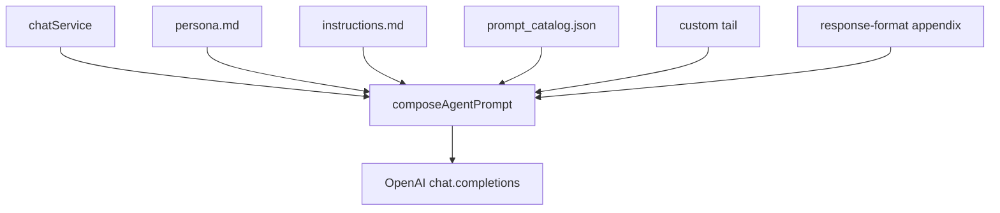

# How agent prompts are constructed today

Evaluation of how detective, attaché, Umbra, and Lumen system prompts are assembled: one shared composer, four registries, and very different “custom/turn” tails. This is the baseline for later collapsing detective/Umbra/Lumen to a stable universal prompt with state passed outside the prompt text.

## Next after review

- Decide how to pass `llmSafeState` (or a subset) into detective/Umbra/Lumen instead of catalog/custom tails.
- List which detective catalog behaviors (return, closure, therapy, scene) move into static instructions vs stay as state flags.

---

All four agents go through one hub: [`composeAgentPrompt`](../api/prompting/promptComposer.js) in [`promptComposer.js`](../api/prompting/promptComposer.js). Paths come from [`promptRegistry.js`](../api/prompting/promptRegistry.js). The **messages** sent to OpenAI are always: system string + optional formatted chat history + current user message ([`buildChatCompletionMessages`](../api/agents/shared/buildChatCompletionMessages.js)).



**Final system string recipe (every agent):**

```
persona.md
+ instructions.md
+ catalogBlocks          (middle layer; usually empty on live detective/attaché)
+ tailCustom             (this is where "custom prompt creation" lives)
+ # Response format      (short Structured Outputs note, or full JSON schema dump)
```

`llmSafeState` is already computed from session/orchestrator facts ([`buildLlmConversationState.js`](../api/orchestration/buildLlmConversationState.js) + `SAFE_VIEW_KEYS`) but **is not appended to `messages[]`**. It is lab/mock/logging only. That is the existing hook for “pass state another way.”

---

## Shared vs custom: what those words mean here

| Layer | What it is | Changes per turn? |
|---|---|---|
| **Universal** | `*_persona.md` + `*_instructions.md` | No (static files) |
| **Catalog / policy** | `prompt_catalog.json` entries selected by XState/policy | Yes, for detective and attaché |
| **`custom` argument** | Extra tail passed into `composeAgentPrompt` | Philosophers: mock dump. Detective/attaché live path: unused or empty |
| **State slice** | `llmSafeState` | Computed, **not sent to the model** |

The user-facing idea of “custom prompt creation” maps to **catalog-driven `# TURN INSTRUCTIONS`** (detective, attaché) plus **`buildPhilosophersCustomPrompt`** (Umbra/Lumen). The old wrapper [`detectiveCustomPromptDEPRECATED.js`](../api/agents/detective/detectiveCustomPromptDEPRECATED.js) has **no importers**.

---

## Detective (live custom is the turn-instruction block)

**Static:** [`detective_persona.md`](../api/prompts/detective/detective_persona.md), [`detective_instructions.md`](../api/prompts/detective/detective_instructions.md).

**Dynamic (this is the custom layer):** [`prompt_catalog.json`](../api/prompts/detective/prompt_catalog.json) bodies assembled as `# TURN INSTRUCTIONS` by [`buildDetectiveTurnInstructionBlock`](../api/prompting/orchestration/buildAgentTurnInstructions.js) → [`getDetectiveTurnInstructions`](../api/agents/detective/detectivePrompts.js).

**Who chooses which catalog rows:**

```
chatService
  → runDetectivePromptPolicyTurn (detectiveExistentialSession)
      → detectiveMachine POLICY_TURN
          → computeDetectiveCatalogInstructionIds (detectivePromptPolicy.js)
  → session.detective_prompt_instruction_ids
  → composeAgentPrompt (no `custom` arg)
```

Typical turn block contents:

- Return / time-away row (`DETECTIVE_RETURN_*`) — **first detective turn only**
- Closure override (`DETECTIVE_CLOSURE_PENULTIMATE` / `ULTIMATE`)
- Existential therapy stage (`EXISTENTIAL_THERAPY_INITIAL|MIDDLE|FINAL`) unless `closure_phase === "ultimate"`
- Scene + `{random_opening_line}` only if first turn + `visit_bin === brief` + no dossier

**Not in the system prompt:** dossier summary, visit_bin, therapy phase label — those sit in `llmSafeState` only. Therapy *copy* is still inlined as catalog markdown.

**Dead / unused:** `detectiveCustomPromptDEPRECATED.js`; [`detective_prompts.md`](../api/prompts/detective/detective_prompts.md) (mock placeholder, registry `promptsPath` only). [`turnBuilderRegistry.buildDetectiveTurn`](../api/prompting/turnBuilderRegistry.js) still duplicates the same turn block for **offline mocks**.

---

## Attaché (most operational custom; likely keep)

Same composer, but the turn tail is required for protocol: exact baseline questions, phase copy, opening line.

```
chatService
  → ATTACHE_BEGIN_TURN on attacheMachine
      → computeAttacheCatalogInstructionIds (attachePromptPolicy.js)
  → session.attache_prompt_instruction_ids
  → runAttacheTurn → composeAgentPrompt
      → buildAttacheTurnInstructionBlock
          → fillTemplate({baselineN_questionQ}, {baselineN_instructions}, {random_opening_line})
```

Catalog: [`attache/prompt_catalog.json`](../api/prompts/attache/prompt_catalog.json). Questions from [`attache_questions.json`](../api/prompts/attache/attache_questions.json). [`attacheCustomPrompt.js`](../api/agents/attache/attacheCustomPrompt.js) returns **`custom: ""`** so the catalog block is not duplicated.

This path is the one that *must* stay instruction-heavy if baseline questions have to be printed verbatim. You did not name attaché in the “remove custom prompts” change; treating it as out of scope for the first cut is the natural reading.

---

## Umbra and Lumen (almost no real custom; mock dump is the custom)

Same pipeline for both. They run **in parallel with detective** in [`chatService.js`](../api/chatService.js) (not as `chatMachine` agent states). [`philosophersMachine.js`](../api/agents/philosophers/philosophersMachine.js) only increments a narrative turn counter.

**Static:** `lumen_persona.md` / `umbra_persona.md` + matching `*_instructions.md`.

**Catalogs:** both [`lumen/prompt_catalog.json`](../api/prompts/lumen/prompt_catalog.json) and [`umbra/prompt_catalog.json`](../api/prompts/umbra/prompt_catalog.json) are `{ "entries": {} }`. `selectSpecialInstructions` returns `[]`. No `# TURN INSTRUCTIONS` builder.

**The only “custom” today** is [`buildPhilosophersCustomPrompt`](../api/agents/philosophers/philosophersCustomPrompt.js):

```
[mock custom lumen] voice=lumen
+ truncated lumen_prompts.md   (status: mock placeholder)
```

Same for Umbra. Session/narrative/dossier are **ignored** by that function (`_session`). `narrative_phase` and `dossier_summary` are computed into `llmSafeState` and **not** put in the system string — even though the instructions tell the model to use “dossier or narrative context.”

Difference between Umbra and Lumen is **file content and JSON field names**, not assembly.

---

## What “remove custom prompt creation” would actually delete

For **Umbra/Lumen**, the cut is small and already labeled mock:

- Stop passing `custom` from `buildPhilosophersCustomPrompt`
- Drop or stop loading `lumen_prompts.md` / `umbra_prompts.md`
- Universal prompt becomes persona + instructions + schema appendix only
- Remaining work is **how** to pass `narrative_phase`, `dossier_summary`, secrets, etc.

For **detective**, the cut is the live product behavior:

- Catalog rows are real copy (return greetings, closure, therapy stages, first-scene opening)
- Policy machines exist specifically to pick those rows
- Removing them means the model must infer return/closure/therapy from **state**, or those behaviors move into the static instructions as general rules

[`SAFE_VIEW_KEYS`](../api/prompting/promptComposer.js) already names the candidate state payload:

- Detective: `dossier_summary`, `existential_therapy_phase`, `visit_bin`, `ms_since_last_visit`, `time_away_context_line`, `temporal_greeting_mode`, instruction ids, turn count, `closure_phase`, `preceding_conversation_summary`
- Lumen/Umbra: `dossier_summary`, `narrative_phase`, `secrets_revealed`, `preceding_conversation_summary`

---

## Implications for the direction you described

A “one universal prompt + pass state another way” design is **half-built**:

1. Universal files already exist per agent (persona + instructions).
2. State is already assembled (`llmSafeState`) but deliberately withheld from the model.
3. Detective/attaché still **translate state into extra prompt prose** via catalogs.
4. Philosophers still append a mock library instead of using the state they already compute.

The smallest next step after this evaluation is choosing **how** state is passed (serialize `llmSafeState` as a system/user JSON block vs a dedicated context message vs tools), and **which detective catalog behaviors must survive as rules in the universal prompt** (especially closure and “print this opening line”).

No code changes in this step — evaluation only.
