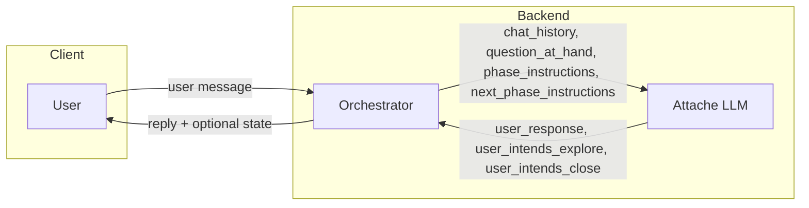
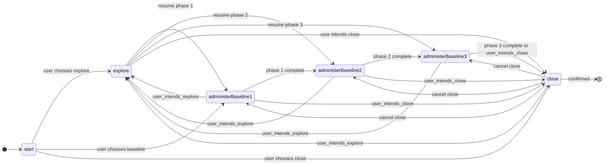

# Orchestrator + Attaché LLM Architecture Outline

## 1. Component overview

Two main components:

- **Orchestrator** (deterministic / rule-based): holds session state, selects phase, samples questions per baseline phase, and invokes the attaché once per user turn. It decides the **next phase** from the attaché’s intent flags and current state (e.g. whether all Q questions in the phase are done).
- **Attaché** (LLM): single conversational agent called **every turn**. Receives full context (chat_history, question_at_hand, phase_instructions, and optionally next_phase_instructions); produces the reply and two booleans that signal user intent (explore vs continue vs close).

No separate “asker” agent: the attaché both speaks and presents the current question when in a baseline phase.

---

## 2. Phase set and flow

**Phase enum (or string union):**

- `start`
- `explore`
- `administerBaseline1`
- `administerBaseline2`
- `administerBaseline3`
- `close`

**Intended flow (orchestrator-driven):**

- `start` → user can go to first baseline phase, or `explore`, or `close`.
- `explore` → orchestrator keeps phase and question index unchanged until user signals “ready for baseline” or “close”.
- `administerBaseline1` … `administerBaseline3` → one phase per baseline block; within each phase the orchestrator advances `question_index` after each user answer until Q questions are done, then moves to the next baseline phase (or to `close` after the last).
- `close` → end of session; attaché asks for confirmation. If the user confirms, end. If the user declines or wants to go back, return to the previous phase and preserve `question_at_hand`. The user can also **explore from close** (e.g. “Actually I have a question”): transition to `explore` with `baseline_phase_when_exploring = phase_before_close` and the same question index; when they are done exploring and say “continue” or “ready,” return to that phase (e.g. phase 2) with the same `question_at_hand` (see below).

Transitions are driven by:

1. **Attaché output:** `user_intends_explore`, `user_intends_close`.
2. **Orchestrator rules:** e.g. if in baseline phase and all Q questions answered → next phase (or close); if `user_intends_explore` → stay in current phase and **do not** increment question index; if `user_intends_close` → move to `close` (possibly after confirmation).

When the user chooses explore from any baseline phase, the orchestrator keeps the **current phase** in state (e.g. administerBaseline2). When the user signals “ready,” the transition from explore goes back to that same phase (resume phase 2), not always to phase 1. From `close`, if the user does not confirm (e.g. “no,” “go back”), the orchestrator returns to the phase stored in `phase_before_close` with the same `question_index`, so `question_at_hand` is preserved. The user can also **explore from close**: if in close they indicate they want to explore (e.g. “I have a question”), transition to `explore` and set `baseline_phase_when_exploring = phase_before_close` and use `question_index_before_close` as the current question index; when they say “continue” or “ready,” the orchestrator returns to that phase (e.g. phase 2) with the same `question_at_hand`.

---

## 3. Session state (orchestrator-owned)

Suggested shape (conceptual; can be adapted to your language/stack):

- **phase** (string): one of start | explore | administerBaseline1 | administerBaseline2 | administerBaseline3 | close.
- **baseline_phase_when_exploring** (optional): when phase is `explore`, store which baseline phase (e.g. administerBaseline2) the user came from so the orchestrator can return to that phase when the user signals “ready.”
- **phase_before_close** (optional): when transitioning into `close`, store the phase the user was in (e.g. administerBaseline2) and **question_index_before_close** so that (1) if the user does not confirm (“no,” “wait,” “go back”), the orchestrator can return to that phase with the same `question_at_hand`, and (2) if the user explores from close, set `baseline_phase_when_exploring = phase_before_close` and use `question_index_before_close` so that when they say “continue,” the orchestrator returns to that phase with the same `question_at_hand`.
- **question_index** (number): index of the current question within the current baseline phase (0-based). Reset when entering a new baseline phase; **not** incremented when in explore.
- **phase_questions** (array of strings per baseline phase): e.g. `phase1_questions`, `phase2_questions`, `phase3_questions` — each is a list of Q (or P) questions **randomly chosen** at phase entry. Optionally store as `baseline_phase_1_questions`, etc., keyed by phase name.
- **chat_history** (list of messages): conversation so far (and optionally metadata per turn). Append user message and attaché reply each turn.
- Optional: **phase_instructions_by_phase** (map phase → string) so the orchestrator can pass the correct rule text per phase.

Question sampling: when transitioning **into** a baseline phase (e.g. from start or from previous baseline phase), the orchestrator samples Q questions from that phase’s **full question bank** and stores them in state; subsequent turns use the same list until the phase completes or user goes to explore/close.

---

## 4. Attaché contract

**Invocation:** Every user turn, the orchestrator calls the attaché **once** with:

| Input                     | Type             | Description                                                                                                                                              |
| ------------------------- | ---------------- | -------------------------------------------------------------------------------------------------------------------------------------------------------- |
| `chat_history`            | list of messages | Full conversation so far (and optionally system/phase context).                                                                                          |
| `question_at_hand`        | string           | The question to present/ask this turn (or null in start/close). When next_phase_instructions is a baseline phase, pass that phase’s first question here. |
| `phase_instructions`      | string           | Rule/instruction text for the **current** phase (e.g. “Answer naturally.”).                                                                              |
| `is_phase_start`          | boolean          | True when this turn is the first in the current baseline phase; attaché should state the phase rule then present the question.                           |
| `next_phase_instructions` | string           | null                                                                                                                                                     |

**Output (structured, e.g. JSON):**

| Output                 | Type    | Description                                                                                                                                                                           |
| ---------------------- | ------- | ------------------------------------------------------------------------------------------------------------------------------------------------------------------------------------- |
| `user_response`        | string  | The attaché’s reply to the user (what the user sees).                                                                                                                                 |
| `user_intends_explore` | boolean | User is asking questions about the system / wants to explore; orchestrator should **not** advance question index and should keep same phase and same `question_at_hand` on next turn. |
| `user_intends_close`   | boolean | User wants to end the baseline/session; orchestrator should move to `close` (possibly after confirmation step).                                                                       |

**No-question case:** When `question_at_hand` is null (e.g. in `start` or `close`), the attaché still receives `chat_history` and `phase_instructions` and returns `user_response` and the two intent flags; it simply does not “present a question.”

**Explore behavior:** When the user is in explore, the orchestrator passes the **same** `phase_instructions` and the **same** `question_at_hand` (and does not increment `question_index`) so that when the user says “I’m ready,” the next turn can resume with the same question.

**Transition reply (next_phase_instructions):** When `next_phase_instructions` is set and the user’s message indicates a transition, the attaché uses it (and current `question_at_hand` when applicable) to produce the reply in one call (e.g. state next phase rule and present the one question, or deliver closing line). There is only one question at a time (`question_at_hand`); no separate “next question” field.

---

## 5. Orchestrator loop (per user message)

1. **Load state** for the session (phase, question_index, phase_questions, chat_history).
2. **Resolve current phase context:**
  - If in `start` or `close`: set `question_at_hand = null`; set `phase_instructions` from phase.
  - If in `explore`: use **current** baseline phase and **current** question index; pass that phase’s instructions and the **same** `question_at_hand` (no increment). If we came from start (no baseline phase yet), pass null and start instructions.
  - If in `administerBaselineN`: set `question_at_hand` to `phaseN_questions[question_index]`; set `phase_instructions` for that phase.
  **Resolve next_phase_instructions** (nullable; set only when a single likely next phase is known):
  - In **start** or **explore** (from start, no baseline phase yet): set `next_phase_instructions` = (administerBaseline1). Ensure the first question of phase 1 is available (e.g. sample phase 1 questions at turn start or when entering start) and pass it as `question_at_hand` so the attaché can say “First question: [question_at_hand]” in the same call.
  - In **explore** (from close): set `next_phase_instructions` = (close) so when the user confirms end, the attaché can deliver the closing line in that turn.
  - In **close**: set `next_phase_instructions` = null (or a literal “end” if you want to signal terminal state).
  - In **administerBaselineN** (mid-phase): `next_phase_instructions` = null. When at the last question of the phase, set `next_phase_instructions` = (administerBaselineN+1) or (close) so the attaché can say “Phase N+1: … First question: …” or the closing line in one call.
3. **Call attaché** with `chat_history`, `question_at_hand`, `phase_instructions`, `is_phase_start`, and `next_phase_instructions`.
4. **Append to chat_history:** user message and attaché’s `user_response`.
5. **Transition logic** (single attaché call per turn; transitions driven by intent after the call; the attaché has already used `next_phase_instructions` to produce the right reply when a transition occurs):
  - If `user_intends_close` → store `phase_before_close` and `question_index_before_close` from current state (when in explore, use baseline_phase_when_exploring and current question_index), then move to `close`. **When in explore and user_intends_close is true,** the orchestrator moves to close; with `next_phase_instructions` = (close) the attaché can have already delivered the closing line in that turn so the session ends consistently. On the next turn(s) in close: (1) if the user confirms → end; (2) if the user does not confirm (e.g. “no,” “go back”) → restore phase and question_index so `question_at_hand` is unchanged; (3) if the user intends to explore (e.g. “I have a question”) → move to `explore`, set `baseline_phase_when_exploring = phase_before_close` and question_index = question_index_before_close, so when they say “continue” or “ready” the orchestrator returns to that phase with the same `question_at_hand`. Detection of cancel vs explore can use a dedicated attaché output or convention (e.g. in close phase, `user_intends_explore` → explore from close; `user_intends_close === false` plus “no”/“back” → cancel close).
  - Else if `user_intends_explore` → keep phase and question_index; next turn will again pass same question_at_hand and phase_instructions.
  - Else if in a baseline phase and user “answered” (no explore/close): increment `question_index`; if `question_index >= length(phase_questions)` then move to next baseline phase (or to `close` if last phase), **sample new Q questions** for the new phase, set `question_index = 0`; the attaché's reply (using next_phase_instructions when set) may already be the next phase intro and first question or the closing line.
  - Else if in **start** or **explore** (from start, no baseline phase yet) and not user_intends_close → transition to administerBaseline1 (sample phase 1 questions, set question_index = 0); the attaché's reply (using next_phase_instructions and question_at_hand) is already the phase 1 intro and first question.
6. **Persist state** (phase, question_index, chat_history, etc.).
7. **Return** `user_response` (and any envelope/metadata) to the client.

---

## 6. Attaché behavior (prompting)

- **Start:** Greet and ask what the user wants (proceed to baseline, explore, or close). No question to display.
- **Explore:** Answer user’s questions about the system; when user indicates ready for baseline or close, set the corresponding intent flag. Use same `phase_instructions` and `question_at_hand` as provided (attaché does not advance; orchestrator does not advance either).
- **Baseline phases:** When `is_phase_start` is true, attaché should **state the rule** from `phase_instructions` and then **present** `question_at_hand`. Otherwise, attaché presents the current `question_at_hand` (or handles explore/close). Interpret user replies as answer, explore, or close and set flags accordingly.
- **Transition (next_phase_instructions):** When `next_phase_instructions` is non-null and the user's message indicates a transition (e.g. "ready for baseline," "I'm sure, end it"), use `next_phase_instructions` (and `question_at_hand` when transitioning into a baseline phase) to generate the transition reply in one go (phase intro + present the one question, or closing line). No separate "next question" field; only `question_at_hand` is used.
- **Close:** Ask for confirmation (“We can end the baseline now. Are you sure?”). If the user confirms (e.g. “yes”), deliver the closing line (“The baseline is over.”). If the user does not confirm (e.g. “no,” “wait,” “I want to go back”), set intent so the orchestrator can return to the previous phase (see below). `question_at_hand` is null in close; the orchestrator preserves `question_at_hand` by storing `phase_before_close` and `question_index_before_close` when entering close, and restoring phase + question_index if the user cancels close, so the same question is shown again.

The orchestrator passes `is_phase_start: true` when entering a baseline phase (first question of that phase) so the attaché reliably “state rule then question” without inferring from history.

---

## 7. Relation to existing code

- [frontend/api/src/beta.js](frontend/api/src/beta.js) implements an **attaché + asker** split: attaché speaks only at checkpoints (intro, baseline_phase_N_start, close); a separate **asker** drives per-question Q&A. Attaché output is `{ phase, interrupt, response }`, not intent booleans.
- Your new design uses a **single attaché every turn** with `user_response`, `user_intends_explore`, `user_intends_close`, and explicit `phase_instructions` + `question_at_hand` + `is_phase_start` + nullable `next_phase_instructions`. The orchestrator uses intent flags and question_index to decide phase and whether to advance.

Implementation options:

- **Option A:** Evolve beta.js: replace the asker with “attaché every turn,” add `phase_instructions` and intent booleans to the attaché I/O, and change the orchestrator to drive phase from intents and question_index (and to pass same question_at_hand when in explore).
- **Option B:** New module (e.g. `baselineOrchestrator.js` + attaché prompt/schema) that implements this contract and state shape, and wire it from your API entrypoint; keep or refactor beta.js separately.

---

## 8. Summary

| Concern                        | Owner        | Notes                                                                                                                                                                                                                                             |
| ------------------------------ | ------------ | ------------------------------------------------------------------------------------------------------------------------------------------------------------------------------------------------------------------------------------------------- |
| Phase and question_index       | Orchestrator | Stored in session state; transitions from intent flags and “all Q done.”                                                                                                                                                                          |
| Question sampling              | Orchestrator | Q (or P) random questions per baseline phase at phase entry.                                                                                                                                                                                      |
| Same question in explore       | Orchestrator | When user_intends_explore, pass same phase_instructions and question_at_hand; do not increment question_index.                                                                                                                                    |
| What to say / intent detection | Attaché LLM  | user_response, user_intends_explore, user_intends_close.                                                                                                                                                                                          |
| phase_instructions             | Orchestrator | Chosen by current phase; passed every turn so attaché can “state the rule” when appropriate.                                                                                                                                                      |
| next_phase_instructions        | Orchestrator | Nullable; set when a single likely next phase is known so the attaché can produce the transition reply (phase intro + question or closing line) in one call. Only one question at a time (question_at_hand).                                      |
| Null question_at_hand          | Both         | Orchestrator sends null in start/close; attaché still returns response + intent flags.                                                                                                                                                            |
| Close confirmation / cancel    | Both         | When entering close, orchestrator stores phase_before_close and question_index_before_close; if user cancels, restore so question_at_hand is preserved.                                                                                           |
| Explore from close             | Orchestrator | If in close and user_intends_explore, transition to explore with baseline_phase_when_exploring = phase_before_close and question_index = question_index_before_close; when user says “continue,” return to that phase with same question_at_hand. |

This gives a clear separation: **orchestrator** = state machine + question sequencing + one call per turn; **attaché** = single LLM that handles all dialogue and declares explore/close intent so the orchestrator can apply the rules above.

---

## 9. Mock chat example: explore at start, then phase 1

Example flow where the user chooses to explore from **start**, asks one question, then moves into baseline phase 1. State transitions: start → explore (user says explore) → still explore (user asks) → administerBaseline1 (user says ready).

| Turn | Phase (before) | question_at_hand | phase_instructions | next_phase_instructions | User message                         | Attaché response                                                                                                                                                 | user_intends_explore | user_intends_close | Phase (after)       |
| ---- | -------------- | ---------------- | ------------------ | ----------------------- | ------------------------------------ | ---------------------------------------------------------------------------------------------------------------------------------------------------------------- | -------------------- | ------------------ | ------------------- |
| 1    | start          | null             | (start)            | null                    | "Hi"                                 | “Hello. We can run the baseline questionnaire, answer questions about this place, or end the session. What would you like?”                                      | false                | false              | start               |
| 2    | start          | null             | (start)            | null                    | “I’d like to learn more first.”      | “Sure. This is the lobby—you can ask me anything about the process or the space, or say when you’re ready for the baseline.”                                     | true                 | false              | explore             |
| 3    | explore        | "What is war?"   | (start)            | (administerBaseline1)   | “What is this place?”                | “This is the lobby of the Existential Detective Agency. The baseline is a short set of questions we run in phases. Whenever you’re ready, we can start phase 1.” | true                 | false              | explore             |
| 4    | explore        | "What is war?"   | (start)            | (administerBaseline1)   | “Okay, I’m ready for the questions.” | “Great. Phase 1: answer naturally and freely. First question: What is war?”                                                                                      | false                | false              | administerBaseline1 |

**State notes:**

- After turn 2: phase = explore, baseline_phase_when_exploring = (none yet; we came from start, so “ready” means start phase 1).
- After turn 4: phase = administerBaseline1, question_index = 0, question_at_hand = “What is war?”, is_phase_start = true. Orchestrator passed next_phase_instructions and the first question so the attaché could reply in one call. Next turn the user would answer that question and the orchestrator would advance question_index.

---

## 10. Mock chat example: explore from close, then return to phase 2

Example flow where the user is in **phase 2**, asks to close, then explores from close (asks a question), and finally says they want to continue — we return to phase 2 with the same `question_at_hand`. State transitions: administerBaseline2 → close (user intends close) → explore (user has a question) → administerBaseline2 (user says continue). The orchestrator remembers `phase_before_close = administerBaseline2` and `question_index_before_close` so the same question is shown again.

| Turn | Phase (before)      | question_at_hand | phase_instructions    | next_phase_instructions | User message                  | Attaché response                                                                                  | user_intends_explore | user_intends_close | Phase (after)       |
| ---- | ------------------- | ---------------- | --------------------- | ----------------------- | ----------------------------- | ------------------------------------------------------------------------------------------------- | -------------------- | ------------------ | ------------------- |
| 1    | administerBaseline2 | “What is war?”   | (administerBaseline2) | null                    | “I want to end the baseline.” | “We can end the baseline now. Are you sure?”                                                      | false                | true               | close               |
| 2    | close               | null             | (close)               | null                    | “Actually I have a question.” | “Of course. What would you like to know?”                                                         | true                 | false              | explore             |
| 3    | explore             | “What is war?”   | (administerBaseline2) | null                    | “What’s the point of this?”   | “The baseline helps the detective understand how you respond. We can continue when you’re ready.” | true                 | false              | explore             |
| 4    | explore             | “What is war?”   | (administerBaseline2) | (administerBaseline2)   | “Okay, let’s continue.”       | “Sure. Here we are again—What is war?”                                                            | false                | false              | administerBaseline2 |

**State notes:**

- After turn 1: phase_before_close = administerBaseline2, question_index_before_close = (e.g. 0), so we know which question they were on (“What is war?”).
- After turn 2: phase = explore, baseline_phase_when_exploring = administerBaseline2, question_index = question_index_before_close; attaché receives the same question_at_hand and phase_instructions so context is preserved.
- After turn 4: phase = administerBaseline2, question_index unchanged; user sees the same question again and can answer or explore/close.

---

## 11. Mock chat example: end of chat — user says “let’s move on”

We start at the end of a phase: the user has just answered the last question of phase 2. They say they want to move on; we transition to phase 3 (or to close if it were the last phase).

| Turn | Phase (before)      | question_at_hand     | phase_instructions    | next_phase_instructions | User message           | Attaché response                                                           | user_intends_explore | user_intends_close | Phase (after)       |
| ---- | ------------------- | -------------------- | --------------------- | ----------------------- | ---------------------- | -------------------------------------------------------------------------- | -------------------- | ------------------ | ------------------- |
| 1    | administerBaseline2 | (first Q of phase 3) | (administerBaseline2) | (administerBaseline3)   | “Okay, let’s move on.” | “Good. Phase 3: rapid associations. First question: [first Q of phase 3].” | false                | false              | administerBaseline3 |

**State notes:** **question_at_hand is always the question to ask this turn** (not the one the user just answered). When the user had just finished the last question of phase 2, the orchestrator moved to administerBaseline3, sampled the new phase's questions, set question_index = 0, and set question_at_hand to the first question of phase 3 before calling the attaché—so the attaché could state the phase 3 rule and present that first question in one reply.

---

## 12. Mock chat example: introduction — user goes directly to baseline test

User skips explore and wants to start the baseline immediately.

| Turn | Phase (before) | question_at_hand | phase_instructions | next_phase_instructions | User message             | Attaché response                                                                                  | user_intends_explore | user_intends_close | Phase (after)       |
| ---- | -------------- | ---------------- | ------------------ | ----------------------- | ------------------------ | ------------------------------------------------------------------------------------------------- | -------------------- | ------------------ | ------------------- |
| 1    | start          | null             | (start)            | null                    | “Hi”                     | “Hello. We can run the baseline, answer questions about this place, or end. What would you like?” | false                | false              | start               |
| 2    | start          | "What is war?"   | (start)            | (administerBaseline1)   | “Let’s do the baseline.” | “Phase 1: answer naturally and freely. First question: What is war?”                              | false                | false              | administerBaseline1 |

**State notes:** User never entered explore; orchestrator went start → administerBaseline1, sampled phase 1 questions, question_index = 0, is_phase_start = true. One call with next_phase_instructions = (administerBaseline1) and question_at_hand = first question so the attaché could reply with phase 1 intro and first question in one call.

---

## 13. Mock chat example: introduction — user skips test, asks in close, then confirms end

User wants to end from the start, enters close, asks a question about closing, then confirms.

| Turn | Phase (before) | question_at_hand | phase_instructions | next_phase_instructions | User message               | Attaché response                                                       | user_intends_explore | user_intends_close | Phase (after) |
| ---- | -------------- | ---------------- | ------------------ | ----------------------- | -------------------------- | ---------------------------------------------------------------------- | -------------------- | ------------------ | ------------- |
| 1    | start          | null             | (start)            | (close)                 | “I want to skip the test.” | “We can end the session now. Are you sure?”                            | false                | true               | close         |
| 2    | close          | null             | (close)            | null                    | “What happens if I leave?” | “You’ll return to the lobby. You can start the baseline another time.” | true                 | false              | explore       |
| 3    | explore        | null             | (close)            | (close)                 | “Okay, I’m sure. End it.”  | “The session is over. Thank you.”                                      | false                | true               | close         |

**State notes:** Turn 1: user_intends_close → phase_before_close = start, we move to close. Turn 2: in close, user asks a question → user_intends_explore (explore from close); baseline_phase_when_exploring = start (or we stay in a “close explore” state). Turn 3: In explore, user says they want to end; orchestrator passed next_phase_instructions = (close), so the attaché delivers the closing line in that turn and returns user_intends_close = true; orchestrator transitions to close and the session ends. (If your implementation treats “explore from close when phase_before_close is start” differently, e.g. no baseline to return to, the attaché can still confirm and end.)

---

## 14. Hints for LLM prompts (attaché)

Use these as prompt fragments or instructions so the attaché behaves consistently with the orchestrator and the examples above.

- **Explore → continue:** “In explore, when the user indicates they’re ready to continue (e.g. ‘let’s continue’, ‘I’m ready’), your reply should present the question (e.g. ‘Sure. Here we are again—[question_at_hand]’) and set user_intends_explore to false.”
- **Phase start:** When is_phase_start is true, state the phase rule from phase_instructions and then present question_at_hand.
- **Close confirmation:** In close, ask for confirmation; if the user confirms, deliver the closing line; if they want to explore or go back, set the appropriate intent (user_intends_explore or cancel-close convention).
- **Intent accuracy:** Always set user_intends_explore and user_intends_close from the user’s last message so the orchestrator can transition correctly; when in doubt, prefer false so the flow does not jump unexpectedly.
- **next_phase_instructions:** When next_phase_instructions is provided and the user's message indicates a transition, use it to generate the reply (e.g. if next is administerBaseline1, state that phase's rule and present question_at_hand; if next is close/end and user confirmed, deliver the closing line). Only question_at_hand is used for the one current/next question.

